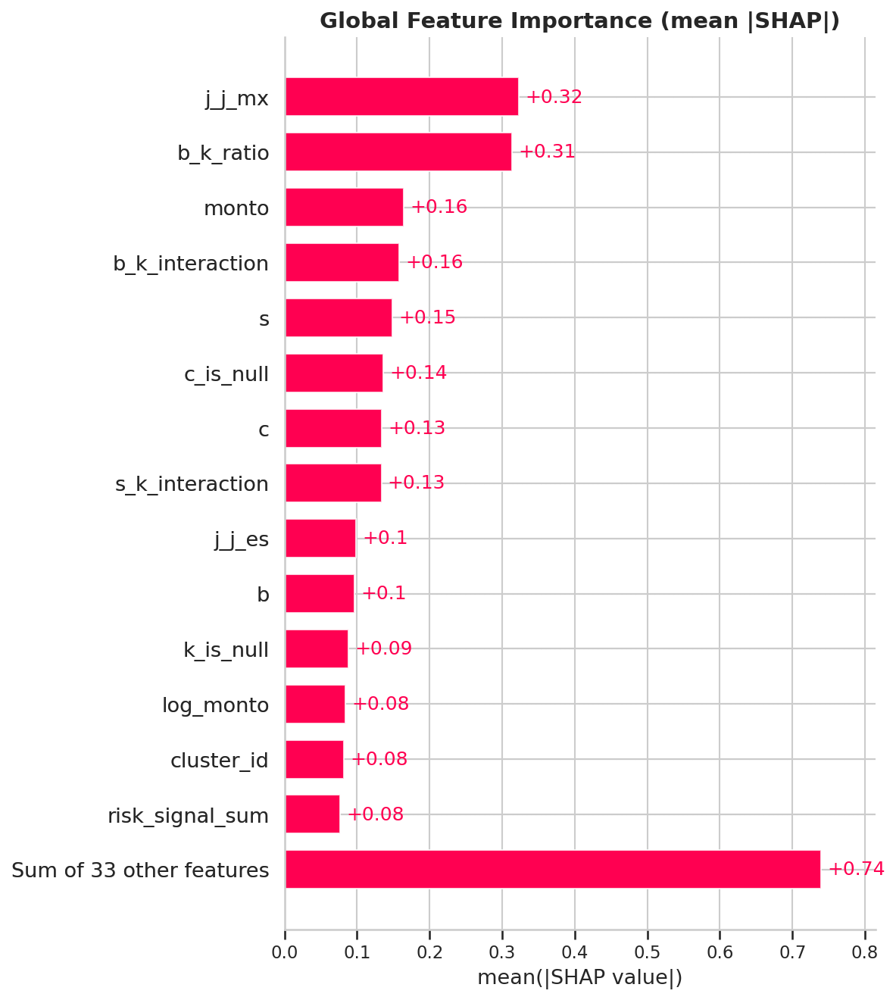

# Fraud Detection in E-Commerce Transactions

> End-to-end machine learning pipeline for identifying fraudulent transactions in a Latin American e-commerce platform. Built with production-grade practices: leakage-free preprocessing, Bayesian hyperparameter optimization, probability calibration, and business impact quantification.

[](https://fraud-transaction-ecommerce.streamlit.app)


---

## Key Results

| Metric | Value |
|--------|-------|
| **F2-Score** (primary) | **0.7164** |
| Recall (fraud detection rate) | 85.0% |
| Precision (review efficiency) | 44.0% |
| ROC-AUC | 0.8225 |
| Net Savings | $74,308 per batch |
| CV Stability (5-fold) | 0.6854 ± 0.0048 |

**The model detects 85% of fraudulent transactions**, generating $74K+ in net savings per 2,532-transaction batch at a review cost of $7 per flag.

---

## Architecture

```mermaid
graph LR
    A[Raw Data<br/>16,879 txns] --> B[Data Cleaning<br/>Type fixes, dedup]
    B --> C[EDA<br/>11 analyses]
    C --> D[Feature Engineering<br/>15 new features]
    D --> E[Stratified Split<br/>70 / 15 / 15]
    E --> F[6 Baseline Models]
    F --> G[Optuna Tuning<br/>Top 2 — 80 trials each]
    G --> H[5-Fold CV<br/>Stability check]
    H --> I[Isotonic Calibration<br/>Brier −17.2%]
    I --> J[Threshold Optimization<br/>F2 + ROI sweep]
    J --> K[SHAP Explainability]
    K --> L[Business Impact<br/>$74K net savings]

    style A fill:#3498db,color:#fff
    style L fill:#2ecc71,color:#fff
```



---

## Problem Statement

E-commerce fraud costs the global industry over **$48 billion annually** (Juniper Research, 2025). This project builds a fraud detection system for a Latin American e-commerce platform using **anonymized transaction data** (features A–S), simulating a real-world scenario where regulatory compliance requires data obfuscation.

**Challenge**: Without domain labels, every insight must be discovered through statistical analysis — making the EDA phase critical.

**Success Criteria**: Maximize fraud detection (recall) while controlling false alarms, with quantified business impact.

---

## Dataset

| Attribute | Detail |
|-----------|--------|
| Transactions | 16,879 |
| Features | 19 numeric (A–S) + 1 categorical (J) + 1 amount (Monto) |
| Target | `fraude` — 1 = Fraud, 0 = Legitimate |
| Fraud Rate | 27.3% (~4,611 fraudulent) |
| Missing Values | K (76.1%), C (18.9%) — missingness is informative |
| Key Finding | 11 of 19 features are zero-dominant (event-based behavioral patterns) |

---

## Methodology

### EDA — 11 Systematic Analyses

Each analysis produced specific findings that directly motivated feature engineering and modeling decisions:

- **Target distribution** — 27.3% fraud rate, 2.66:1 class imbalance
- **Geographic risk** (Feature J) — UY (100%), ES (94%), US (85%) fraud rates identified
- **Zero-dominant features** — 11 sparse features where activation shifts fraud rate up to +21pp
- **Continuous feature separability** — B (0.73), S (0.56), K (0.53) ranked as top continuous predictors
- **Correlation & Point-Biserial** — B↔K (ρ=−0.66), I↔E (ρ=0.67) interactions discovered
- **Missing value analysis** — null K and C carry different fraud rates than non-null
- **Outlier detection** — outliers carry fraud signal, retained for tree models
- **Mutual Information ranking** — model-agnostic feature importance pre-modeling
- **PCA exploration** — confirmed fraud is not linearly separable (visualization only, not used as features)
- **Clustering** — behavioral archetypes with distinct fraud rates discovered

### Feature Engineering — 15 New Features (All EDA-Motivated)

| Feature | EDA Source | Rationale |
|---------|-----------|-----------|
| `c_is_null`, `k_is_null` | §2.6 | Missingness carries fraud signal |
| `log_monto` | §2.4 | Normalizes right-skewed amount |
| `zero_count`, `binary_sum` | §2.3 | Behavioral fingerprint from 11 sparse features |
| `high_risk_flag_count` | §2.3 | Count of H/O/R/Q activations (strongest signals) |
| `b_k_interaction`, `b_k_ratio` | §2.5 | Captures B↔K inverse correlation |
| `i_e_interaction`, `s_k_interaction` | §2.5 | Correlated pair interactions |
| `cluster_id` | §2.9 | Behavioral archetypes (KMeans k=5, fit on train) |
| `activity_score`, `risk_signal_sum` | §2.4 | Aggregate activity and risk signals |
| `monto_bin` | §2.4 | Domain-driven amount risk bands |

**Validation**: 5 of the top 10 SHAP features are engineered — feature engineering adds measurable predictive value.

### Modeling Pipeline — Zero Leakage

1. **Split first** — 70/15/15 stratified before any fitted transforms
2. **6 baselines** — DummyClassifier → LR → RF → XGBoost → LightGBM → CatBoost
3. **Optuna tuning** — Top 2 models dynamically selected, 80 Bayesian trials each, F2 objective, regularization-constrained search space (`num_leaves ≤ 64`, `reg ≥ 0.1`, `min_child ≥ 5`)
4. **5-fold CV** — Stability check (F2 = 0.6854 ± 0.0048, Train-CV gap = 0.048)
5. **Isotonic calibration** — Brier Score improved 17.2% (0.1643 → 0.1361)
6. **Threshold optimization** — F2-optimal (θ=0.176) + ROI sweep on validation set
7. **SHAP explainability** — Global importance, dependence plots, individual waterfalls

---

## Model Comparison

| Model | F2 | Recall | Precision | ROC-AUC |
|-------|-----|--------|-----------|---------|
| **LightGBM (tuned)** | **0.7133** | **76.4%** | **55.1%** | **0.832** |
| CatBoost (tuned) | 0.7062 | — | — | — |
| CatBoost (baseline) | 0.7063 | 75.3% | 56.6% | 0.843 |
| LightGBM (baseline) | 0.6954 | 73.0% | 58.5% | 0.841 |
| XGBoost | 0.6920 | 72.5% | 58.4% | 0.839 |
| Logistic Regression | 0.6767 | 73.6% | 51.3% | 0.809 |
| Random Forest | 0.4800 | 44.7% | 68.5% | 0.823 |
| Dummy (floor) | 0.2907 | 29.1% | 29.2% | 0.513 |

---

## SHAP Feature Importance

The top predictors are geographic risk (`j_j_mx`) and an **engineered feature** (`b_k_ratio`), confirming that both EDA-driven feature engineering and geographic analysis add measurable value beyond the original anonymized columns.



**Top 5 features:**
1. `j_j_mx` (0.32) — geographic signal (Mexico = low risk)
2. `b_k_ratio` (0.31) — engineered B/K interaction ratio
3. `monto` (0.16) — transaction amount
4. `b_k_interaction` (0.16) — engineered B×K product
5. `s` (0.15) — continuous feature S

---

## Business Impact

| Scenario | Threshold | Net Savings | Recall | Flagged % |
|----------|-----------|-------------|--------|-----------|
| Do Nothing | — | −$96,255 | 0% | 0% |
| Default (0.50) | 0.50 | varies | ~46% | ~18% |
| **F2-Optimal** | **0.176** | **+$74,308** | **85.0%** | **52.6%** |
| ROI-Optimal | 0.05 | varies | ~99% | ~89% |

---

## Live Demo

[](https://fraud-transaction-ecommerce.streamlit.app)

The interactive dashboard includes:
- **Model Performance** — metrics, baseline comparison, calibration analysis
- **ROI Simulator** — adjust threshold and business parameters in real-time
- **Transaction Scanner** — score individual transactions with risk assessment
- **Model Explainability** — SHAP analysis and decision examples

---

## Technical Decisions

| Decision | Rationale |
|----------|-----------|
| `scale_pos_weight` over SMOTE | Native weighting avoids synthetic artifacts in sparse feature space (11 of 19 features are >50% zeros) |
| F2 over F1 | Cost asymmetry: missed fraud ($50–100) >> false alarm review ($7) |
| Isotonic calibration | Reliable probability estimates for threshold optimization and ROI |
| Optuna over GridSearch | Bayesian TPE converges in 80 trials vs thousands of grid combinations |
| Regularization-constrained search | `num_leaves ≤ 64`, `reg ≥ 0.1`, `min_child ≥ 5` — prevents overfitting on 11K rows (Train-CV gap = 0.048) |
| Dynamic model selection | Top 2 by F2 selected automatically — reproducible, not hardcoded |
| No PCA features | Trees do implicit feature selection; PCA destroys interpretability |
| Cluster as feature | Captures multi-feature behavioral combinations, fit on train only |

---

## Project Structure

```
fraud-transaction-ecommerce/
├── fraud_detection_ecommerce.ipynb    # Full analysis notebook
├── fraud-prevention.csv               # Dataset (16,879 transactions)
├── models/
│   ├── champion_baseline.pkl          # Pre-calibration LightGBM
│   ├── champion_calibrated.pkl        # Isotonic-calibrated model
│   └── champion_final.pkl             # Final model + threshold + metadata
├── reports/
│   ├── test_results.json              # Official test metrics
│   ├── tuning_report.json             # Optuna best parameters
│   ├── shap_global_bar.png            # Feature importance plot
│   ├── shap_beeswarm.png              # SHAP value distributions
│   ├── shap_dependence_top3.png       # Top 3 dependence plots
│   ├── shap_waterfall_high_risk.png   # High-risk decision example
│   └── shap_waterfall_low_risk.png    # Low-risk decision example
├── streamlit_app/                     # Interactive dashboard
│   ├── app.py                         # Main page
│   ├── pages/                         # 4 dashboard pages
│   ├── models/                        # Model copies for deployment
│   ├── data/                          # Precomputed predictions
│   └── requirements.txt              # Streamlit Cloud dependencies
├── requirements.txt                   # Full project dependencies
├── .gitignore
└── README.md
```

---

## How to Run

### Prerequisites
```bash
git clone https://github.com/marianunez-data/fraud-transaction-ecommerce.git
cd fraud-transaction-ecommerce
python -m venv venv
source venv/bin/activate      # Linux/Mac
# venv\Scripts\activate       # Windows
pip install -r requirements.txt
```

### Run Notebook
```bash
jupyter notebook fraud_detection_ecommerce.ipynb
```

### Run Dashboard Locally
```bash
cd streamlit_app
streamlit run app.py
```

---

## Tech Stack

| Category | Tools |
|----------|-------|
| ML Framework | LightGBM, scikit-learn |
| Hyperparameter Tuning | Optuna (TPE Bayesian search) |
| Explainability | SHAP (TreeExplainer) |
| Calibration | Isotonic Regression (scikit-learn) |
| Dashboard | Streamlit, Plotly |
| Data Processing | pandas, NumPy, SciPy |
| Visualization | Matplotlib, Seaborn, Plotly |

---

## Limitations & Future Work

1. **Anonymized features** limit domain-specific interpretation and stakeholder communication
2. **Geographic concentration** (95.5% Latin America) — model may not generalize to other markets
3. **Static evaluation** — production requires continuous drift monitoring (Evidently AI)
4. **No temporal features** — transaction sequence and velocity patterns unavailable
5. **Dataset size** (16,879 rows) limits deep learning approaches

### Production Roadmap
1. FastAPI real-time inference endpoint (<100ms latency)
2. Feature store for consistent train/serve feature computation
3. Model monitoring with PSI-based drift detection
4. A/B testing framework before full deployment
5. Human-in-the-loop review queue for borderline predictions

---

## Author

**Maria Nunez** — Data Scientist

[](https://github.com/marianunez-data)

---

*Built as a portfolio project demonstrating end-to-end ML pipeline development with production-grade practices.*
